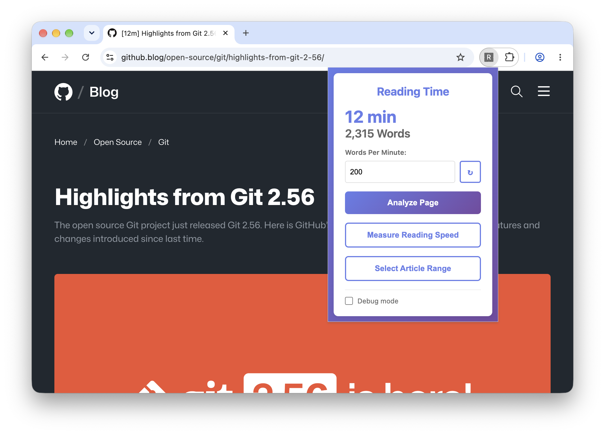

# Reading Time Chrome Extension

A lightweight Chrome extension that estimates reading time for web pages.

**Features:**

- Custom reading speed
- Measure actual reading speed
- Show reading time in tab titles
- Override article text selection

## Installation & Setup

1. Clone or download the extension folder
2. Run `npm install` and `npm run build` to compile and bundle TypeScript files
3. Open Chrome and go to `chrome://extensions/`
4. Enable **Developer mode** (top-right toggle)
5. Click **Load unpacked** and select the extension folder
6. The extension icon will appear in your Chrome toolbar

Note: After reloading the extension the popup may not work until you refresh the current page because the content script is not automatically injected into already loaded pages.

## Usage

1. Navigate to any web page
2. Click the Reading Time extension icon to view popup w/ reading time and word count
3. To override what text is treated as article text:
   - Click **Select Article Range** in the popup
   - Click the first paragraph of the article on the page
   - Click the last paragraph of the article on the page
   - The extension uses the nearest common ancestor of those selections as the article container
   - The chosen container's selector is saved per-site, so it's reapplied automatically on future visits (if it still matches exactly one element)

## Configuration

Words per minute can be customized in the popup. Click the reset button to revert to the default of 200. You can also use the Measure Reading Speed button to manually measure your reading speed and then save the updated value.

## Future Enhancements

- [x] Customizable reading speed
- [ ] Reading time indicator on page
- [x] Show reading time in tab titles
- [x] Measure actual reading speed
- [x] Custom selection of reading text
- [x] Persistent article selection per page/site
- [x] Debug mode that shows what text is analyzed and where the word boundaries are

## Known Issues

- Escape key does not cancel article selection mode until first paragraph is selected
- Debug overlay word count is higher than popup count
- Doesn't gracefully handle exceeding storage quota (unlikely to hit this in typical usage)

🤖 Built w/ help from AI
